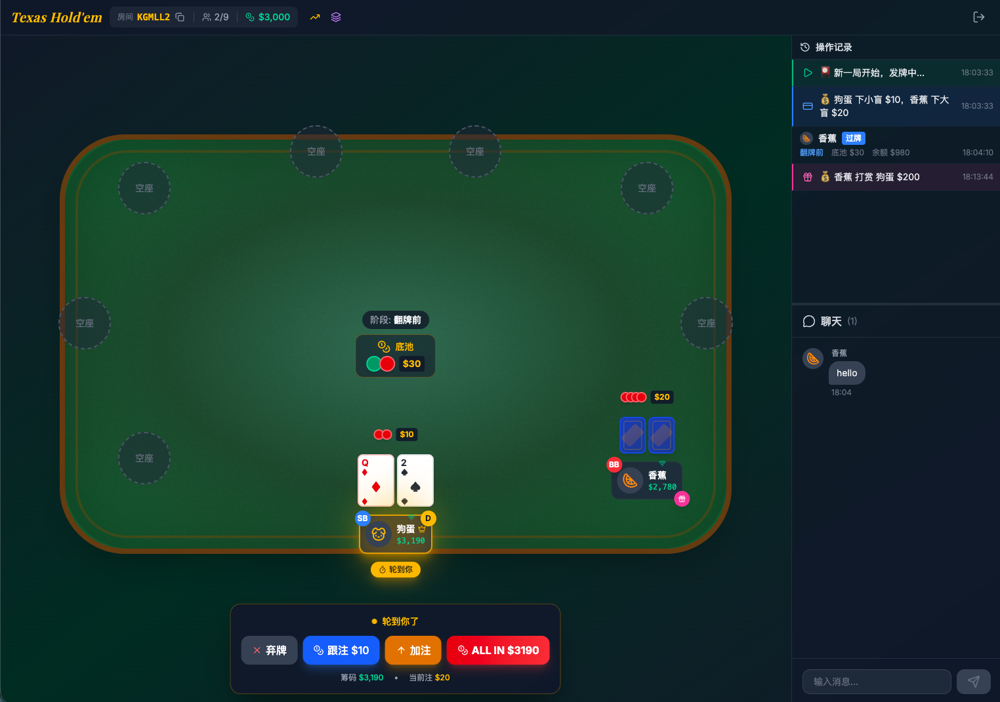

# 德州扑克交互式模拟教学演示

> 🤖 **AI Generated Project**
>
> 本项目几乎完全由 AI 生成，践行 **[Vibe Coding](https://en.wikipedia.org/wiki/Vibe_coding)** 理念。
>
> - **AI Model**: Claude Opus 4.5
> - **IDE**: Cursor
> - **开发方式**: 通过自然语言描述需求，AI 自动生成代码，人类几乎不直接编写代码
>
> _"Vibe Coding" 由 Andrej Karpathy 提出 —— 完全拥抱 AI，只描述意图，让 AI 处理实现细节。_

---

一个基于 WebRTC 的德州扑克交互式模拟教学演示系统，支持最多 9 人同时参与，专为德州扑克学习者设计，提供实时手牌分析、中牌概率计算、起手牌力指南等教学辅助功能。



## ✨ 功能特性

### 📚 教学辅助

- 🎯 **实时手牌分析** - 根据当前手牌和公共牌，实时显示中牌概率
- 📊 **起手牌力指南** - 翻牌前显示起手牌等级（S/A/B/C/D 级）及策略建议
- 🔮 **中牌概率计算** - 动态计算同花、顺子、葫芦等牌型的成牌概率
- 📖 **牌型大小参考** - 详细的牌型说明与出现概率统计
- 💡 **术语解释** - 后门顺子、听牌、outs 等专业术语的通俗解释
- 🎓 **策略提示** - 根据手牌情况提供简要操作建议

### 🎮 模拟游戏

- 🃏 完整的德州扑克游戏规则实现
- 👥 支持 2-9 人同时参与模拟
- 🌐 基于 WebRTC 的 P2P 连接（无需后端服务器）
- 💰 小盲/大盲、加注规则完整实现
- 🏆 支持边池计算（多人 All-in 场景）
- 🎁 玩家间打赏功能（带飞行金币动画）

### 用户体验

- 💬 实时文字聊天（带气泡显示）
- 🎨 精美的赌场风格 UI
- ✨ 丰富的动画效果
  - 发牌动画
  - 加注时的金色光效
  - All-in 时的震动效果
  - 胜利/失败的全屏动画
  - 打赏金币飞行动画
- 🖼️ 48 种 Lucide 图标头像可选
- 📊 操作历史记录面板
- 📱 响应式设计

### 技术亮点

- 🔗 分享房间链接直接加入
- 💾 玩家信息本地持久化
- 🎚️ 可拖拽调整侧边栏布局
- 📡 实时游戏状态同步

## 🛠️ 技术栈

| 类别     | 技术                             |
| -------- | -------------------------------- |
| 前端框架 | Vue 3 + TypeScript               |
| 构建工具 | Vite                             |
| 样式     | TailwindCSS v4                   |
| 状态管理 | Pinia                            |
| WebRTC   | PeerJS (PeerJS Cloud 信令服务器) |
| 图标     | Lucide Icons                     |
| 路由     | Vue Router                       |

## 🚀 快速开始

```bash
# 安装依赖
pnpm install

# 启动开发服务器
pnpm dev

# 构建生产版本
pnpm build

# 预览生产构建
pnpm preview
```

## 🎮 使用方法

### 创建/加入房间

1. **创建房间**: 输入昵称，选择头像，点击"创建房间"
2. **加入房间**: 输入昵称和 6 位房间号，或通过分享链接直接加入
3. **开始演示**: 房主在至少 2 人加入后点击"开始游戏"

### 操作说明

| 操作          | 说明                            |
| ------------- | ------------------------------- |
| 弃牌 (Fold)   | 放弃当前手牌                    |
| 过牌 (Check)  | 不加注继续（仅当无需跟注时）    |
| 跟注 (Call)   | 跟上当前下注额                  |
| 加注 (Raise)  | 提高下注额（需 ≥ 上次加注增量） |
| 全下 (All-in) | 押上所有筹码                    |

### 教学功能使用

- **查看起手牌力**: 发牌后，手牌右侧会自动显示起手牌等级和策略建议
- **查看中牌概率**: 翻牌后，手牌右侧显示最可能达成的牌型及概率
- **查看详细信息**: 点击"查看更多"或顶部"牌型"按钮，打开详细的牌型说明弹窗
- **查看起手胜率**: 点击顶部"胜率"按钮，查看各类起手牌的胜率参考

## 📁 项目结构

```
texas-holdem/
├── src/
│   ├── components/
│   │   ├── chat/
│   │   │   └── ChatBox.vue         # 聊天框组件
│   │   ├── common/
│   │   │   └── AvatarPicker.vue    # 头像选择器
│   │   ├── game/
│   │   │   ├── ActionHistory.vue   # 操作历史记录
│   │   │   ├── ActionPanel.vue     # 操作面板（弃牌/加注等）
│   │   │   ├── Card.vue            # 扑克牌组件
│   │   │   ├── ChipStack.vue       # 筹码堆叠显示
│   │   │   ├── HelpModal.vue       # 帮助弹窗（牌型/概率分析）
│   │   │   ├── PlayerSeat.vue      # 玩家座位（含教学提示）
│   │   │   ├── PokerTable.vue      # 牌桌
│   │   │   └── PotDisplay.vue      # 底池与状态显示
│   │   └── lobby/
│   │       └── LobbyPanel.vue      # 大厅面板
│   ├── composables/
│   │   ├── use-chat.ts             # 聊天功能
│   │   ├── use-game.ts             # 游戏状态管理
│   │   └── use-peer.ts             # PeerJS 连接管理
│   ├── core/
│   │   ├── deck.ts                 # 牌组管理
│   │   ├── game-engine.ts          # 游戏引擎（核心逻辑）
│   │   ├── hand-evaluator.ts       # 牌型评估
│   │   ├── hand-odds.ts            # 手牌分析与概率计算
│   │   └── types.ts                # TypeScript 类型定义
│   ├── stores/
│   │   ├── game-store.ts           # 游戏状态 Store
│   │   └── player-store.ts         # 玩家信息 Store
│   ├── utils/
│   │   └── avatars.ts              # 头像配置
│   ├── views/
│   │   ├── GameView.vue            # 游戏主视图
│   │   └── HomeView.vue            # 首页
│   ├── App.vue
│   ├── main.ts
│   └── style.css
├── index.html
├── package.json
├── tsconfig.json
└── vite.config.ts
```

## 🃏 德州扑克规则参考

### 牌型大小（从高到低）

| 排名 | 牌型       | 说明                             | 出现概率   |
| ---- | ---------- | -------------------------------- | ---------- |
| 1    | 皇家同花顺 | A K Q J 10 同花色                | 0.000154%  |
| 2    | 同花顺     | 五张连续同花色                   | 0.00139%   |
| 3    | 四条       | 四张相同点数                     | 0.024%     |
| 4    | 葫芦       | 三条 + 一对                      | 0.14%      |
| 5    | 同花       | 五张同花色                       | 0.20%      |
| 6    | 顺子       | 五张连续点数（A 可作最大或最小） | 0.39%      |
| 7    | 三条       | 三张相同点数                     | 2.11%      |
| 8    | 两对       | 两个对子                         | 4.75%      |
| 9    | 一对       | 两张相同点数                     | 42.3%      |
| 10   | 高牌       | 最大单张                         | 50.1%      |

### 游戏阶段

```
翻牌前 (Preflop)  →  翻牌 (Flop)  →  转牌 (Turn)  →  河牌 (River)  →  摊牌 (Showdown)
    发2张底牌         发3张公共牌      发第4张公共牌    发第5张公共牌      比较牌型大小
```

### 起手牌等级参考

| 等级 | 牌型示例                    | 胜率范围 | 建议     |
| ---- | --------------------------- | -------- | -------- |
| S 级 | AA, KK, QQ, AKs             | 65-85%   | 强势加注 |
| A 级 | JJ, TT, AQs, AJs, KQs       | 55-65%   | 积极参与 |
| B 级 | 99-77, ATs, KJs, QJs        | 50-58%   | 位置好时参与 |
| C 级 | 小对子, 同花连牌            | 45-52%   | 谨慎参与 |
| D 级 | 小连牌, 边缘牌              | 40-48%   | 娱乐/后位参与 |

### 术语说明

- **听牌 (Draw)**: 还差一张牌就能组成强牌型
- **后门 (Backdoor)**: 需要转牌和河牌都中才能成牌
- **Outs**: 能改善手牌的剩余牌张数
- **底池赔率 (Pot Odds)**: 跟注金额与底池的比值

## ⚠️ 免责声明

> **本项目为德州扑克规则教学演示工具，仅供学习交流使用。**

- 🎓 所有筹码均为**虚拟筹码**，无任何实际价值
- 💳 不支持任何形式的充值、提现或兑换
- 🚫 请勿将本工具用于任何形式的赌博活动
- ⚖️ **赌博违法，请遵守当地法律法规**

## 📝 注意事项

- 使用 PeerJS Cloud 免费服务，适合小规模使用
- 基于 Host 模式，创建房间的玩家负责游戏逻辑计算
- 需要稳定的网络连接以保证演示体验
- 房主断开连接会导致演示中断

## 📄 License

MIT
